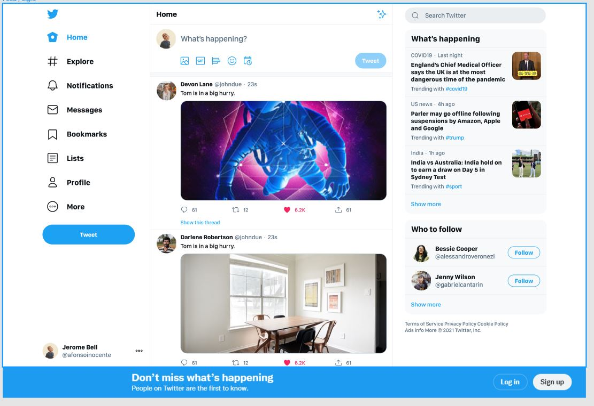

<h2>Development project for Compass PB.</h2>

<h2>Status: Done</h2>

<h2>Project: Twitter</h2>

<h2>Technologies used:</h2>

<h3>CSS</h3>
<h3>Typescript</h3>
<h3>Vite</h3>
<h3>Storybook</h3>
<h3>API IMGUR</h3>
<h3>API MOMENT JS</h3>

<h3>Start project yarn or npm i</h3>
<h3>Run project yarn or npm run dev</h3>

